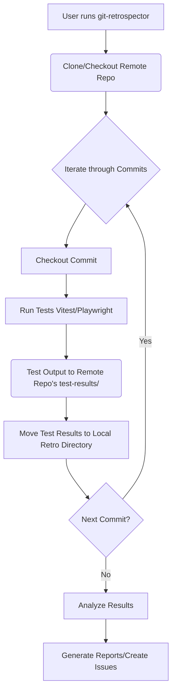

# git-retrospector

This is a Python module for running tests on a range of Git commits and analyzing the results. It was refactored from scripts originally located in the `handterm-wiki/scripts` directory of the `handterm-proj` repository.

## Functionality

The module provides the following functionality:

*   Runs Vitest and Playwright tests on a specified Git repository for a range of commits.
*   Parses the XML output from the tests and generates a summary CSV file.
*   Processes individual XML test result files, extracting relevant data.

## Installation
```
python3 -m venv .venv
source .venv/bin/activate
pip install -e .
```

## Usage

The main entry point is the `retrospector.py` module. It can be run from the command line with the following arguments:

```
usage: retrospector.py [-h] [-i ITERATIONS] [-c COMMIT_DIR] target_repo

Run tests on a range of commits and parse results.

positional arguments:
  target_repo           Path to the target repository

options:
  -h, --help            show this help message and exit
  -i ITERATIONS, --iterations ITERATIONS
                        Number of iterations (default: 10)
  -c COMMIT_DIR, --commit_dir COMMIT_DIR
                        Specific commit directory to process
```

For example:

```
python -m git_retrospector.retrospector /path/to/repo -i 5
```

This will run tests on the repository located at `/path/to/repo` for the last 5 commits.

## Structure

The module is organized as follows:

*   `retrospector.py`: Contains the core logic for running tests on a range of commits.
*   `parser.py`: Contains the logic for parsing XML test results and generating a summary CSV.
*   `xml_processor.py`: Contains the logic for processing a single XML test result file.
*   `tests/`: Contains unit tests.

## Workflow



## Directory Structure

```
retros/
├── <remote_name_1>/       # Directory for a remote repo
│   ├── config.toml        # Configuration file for this remote
│   └── test-output/       # Directory for test output
│       └── <commit_hash>/  # Directory for a specific commit
│           ├── playwright.xml # Playwright JUnit-schema test output
│           ├── vitest.xml # Vitest JUnit-schema test output
│           └── tool-summary/   # Summary of test results
│               ├── playwright.csv   # CSV file with Playwright test results
│               └── vitest.csv      # CSV file with Vitest test results (if applicable)
│           └── playwright.xml # Raw Playwright XML output
│           └── ...            # Other output files (screenshots, videos, traces)
├── <remote_name_2>/       # Another remote repository
│   ├── config.toml
│   └── test-output/
│       └── ...
└── ...
